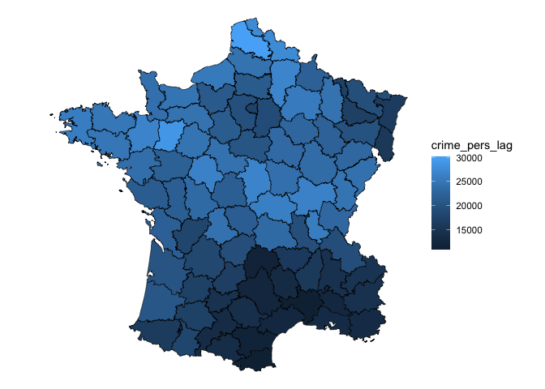

<!-- README.md is generated from README.Rmd. Please edit that file -->

# sfdep

<!-- badges: start -->

[](https://lifecycle.r-lib.org/articles/stages.html#experimental)
[](https://CRAN.R-project.org/package=sfdep)
<!-- badges: end -->

sfdep is an interface to the spdep package that is intended to work
within your normal dplyr workflow by using sf objects and list columns.

## Installation

You can install the development version of sfdep like so:

``` r
remotes::install_github("josiahparry/sfdep")
```

## Usage

To identify polygon neighbors, one uses `st_contiguity()` on the sf
geometry column. This creates a `nb` object which will be utilized in
most other computations. To create row standardized weights utilize
`st_weights()`.

``` r
library(sfdep)
library(dplyr)
library(ggplot2)

# create neighbors and weights
g <- guerry %>% 
  mutate(nb = st_contiguity(geometry),
         wt = st_weights(nb))
```

Then calculate the spatial lag with `st_lag()`. Given that we’ve only
modified an sf object, we can visualize this with ggplot2.

``` r
# create spatial lag
g %>% 
  mutate(crime_pers_lag = st_lag(crime_pers, nb, wt)) %>% 
  ggplot(aes(fill = crime_pers_lag)) + 
  geom_sf(lwd = 0.2, color = "black") +
  theme_void()
```



Most users will be interested in local indicators of spatial association
(LISA). Utilize `local_moran()` to do this. `local_moran()` will create
a data frame column which contains a number of informative variables.
For example the cluster that a polygon falls into based on mean, median,
or pysal calulations. This will need to be unnested or certain variables
hoisted.

Create the Local Moran data frame column.

``` r
lisa <- g %>% 
  mutate(moran = local_moran(crime_pers, nb, wt))

pull(lisa, moran) %>% 
  glimpse()
#> Rows: 85
#> Columns: 12
#> $ ii           <dbl> 0.52226452, 0.82801651, 0.80353997, 0.74188966, 0.2311871…
#> $ eii          <dbl> 0.0223285405, -0.0009606959, -0.0164228650, 0.0168441997,…
#> $ var_ii       <dbl> 0.3608305569, 0.1235336535, 0.1444982558, 0.2410063421, 0…
#> $ z_ii         <dbl> 0.8322671, 2.3585764, 2.1570632, 1.4768997, 1.2110283, 1.…
#> $ p_ii         <dbl> 0.405258184, 0.018345184, 0.031000742, 0.139702527, 0.225…
#> $ p_ii_sim     <dbl> 0.404, 0.036, 0.032, 0.180, 0.208, 0.132, 0.564, 0.124, 0…
#> $ p_folded_sim <dbl> 0.202, 0.018, 0.016, 0.090, 0.104, 0.066, 0.282, 0.062, 0…
#> $ skewness     <dbl> 0.2149429650, 0.1740988144, 0.0999639801, -0.1032850122, …
#> $ kurtosis     <dbl> -0.07276546, 0.30917928, -0.56790331, -0.21622565, -0.161…
#> $ mean         <fct> High-High, High-High, High-High, Low-Low, Low-Low, Low-Lo…
#> $ median       <fct> High-High, High-High, High-High, Low-Low, Low-Low, Low-Lo…
#> $ pysal        <fct> High-High, High-High, High-High, Low-Low, Low-Low, Low-Lo…
```

Visualize this.

``` r
lisa %>% 
  tidyr::unnest(moran) %>% 
  ggplot(aes(fill = mean)) +
  geom_sf() +
  geom_sf(lwd = 0.2, color = "black") +
  theme_void() +
  scale_fill_manual(values = c("#1C4769", "#24975E", "#EACA97", "#B20016"))
```


<!-- ## Neighbor apply function -->
<!-- In the case that you want to create custom local level metrics, you can do so with the function `st_nb_apply()`. This provides a purrr like interface to do calculation on an observation $x_{i}$ using it's neighbors, $x_{ij}$, and their respective weights $w_{ij}$. In the formula syntax utilize `.xij`, `.nb` and `.wt` for these values respectively. We can specify the type of output with the suffix argument. By default this will be `"dbl"`. These can be any purrr sufix. To get the default list output use `"list"`.  -->
<!-- For example  -->
<!-- ```{r} -->
<!-- g %>%  -->
<!--   transmute(x = st_nb_apply(crime_pers, nb, wt,  -->
<!--                             .f = function(.xij, .wt, ...) sum((.xij - crime_pers)^2) / (length(.wt) + 1), suffix = "dbl")) -->
<!-- ``` -->
