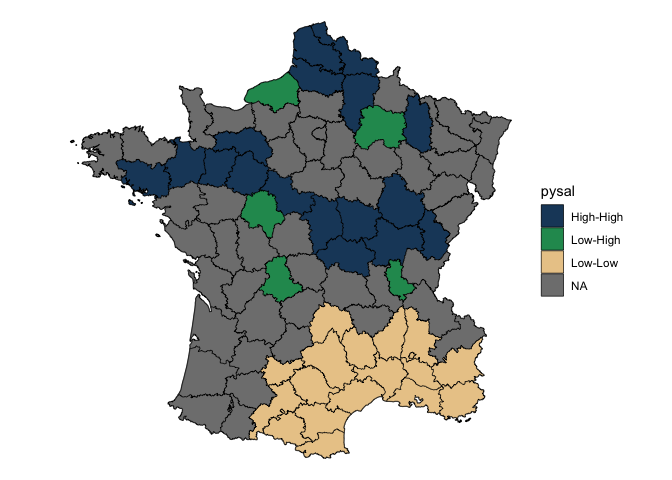

<!-- README.md is generated from README.Rmd. Please edit that file -->

# sfdep

<!-- badges: start -->

[](https://CRAN.R-project.org/package=sfdep)
[](https://github.com/JosiahParry/sfdep/actions/workflows/R-CMD-check.yaml)
[](https://lifecycle.r-lib.org/articles/stages.html#stable)
<!-- badges: end -->

sfdep builds on the great shoulders of spdep package for spatial
dependence. sfdep creates an sf and tidyverse friendly interface to the
package as well as introduces new functionality that is not present in
spdep. sfdep utilizes list columns extensively to make this interface
possible.

## Installation

Install the released version from CRAN

``` r
install.packages("sfdep")
```

You can install the development version of sfdep like so:

``` r
remotes::install_github("josiahparry/sfdep")
```

## Usage

There are three main categories of functionality relating to geometry
neighbors, weights, and local indicators of spatial association (LISAs).

### Neighbors

The most fundamental usage is to find contiguous neighbors from a
polygon. This is done with `st_contiguity()` which, by default creates
queen weights. If rook weights are desired, set `queen = FALSE`.
Additional arguments can be passed to the underlying `spdep::poly2nb()`
via `...`. `st_contiguity()` creates an object of class `nb` as used by
`spdep`.

``` r
library(sf)
library(sfdep)
library(dplyr)

# grab geometry
geo <- st_geometry(guerry)

nb <- st_contiguity(geo)

nb
#> Neighbour list object:
#> Number of regions: 85 
#> Number of nonzero links: 420 
#> Percentage nonzero weights: 5.813149 
#> Average number of links: 4.941176
```

We can identify higher order neighbors with `st_nb_lag()` and the
cumulative higher order neighbors with `st_nb_lag_cumul()`.

``` r
st_nb_lag(nb, 2)
#> Neighbour list object:
#> Number of regions: 85 
#> Number of nonzero links: 756 
#> Percentage nonzero weights: 10.46367 
#> Average number of links: 8.894118
st_nb_lag_cumul(nb, 2)
#> Neighbour list object:
#> Number of regions: 85 
#> Number of nonzero links: 1176 
#> Percentage nonzero weights: 16.27682 
#> Average number of links: 13.83529
```

Other point geometry neighbor functions are `st_knn()`,
`st_dist_band()`, `st_nb_dists()`.

### Weights

Polygon weights are created with `st_weights()` (which calls
`spdep::nb2listw`). By default they are row standardized weights.

``` r
wt <- st_weights(nb)

wt[1:2]
#> [[1]]
#> [1] 0.25 0.25 0.25 0.25
#> 
#> [[2]]
#> [1] 0.1666667 0.1666667 0.1666667 0.1666667 0.1666667 0.1666667
```

Other point based weights can be created with `st_nb_dists()`,
`st_kernel_weights()` and `st_inverse_weights()`.

### Local Indicators of Spatial Association (LISAs)

LISAs are created from a combination of neighbors and weights and are
intended to be used inside of a dplyr pipeline. The below is a worked
example of calculating the spatial lag and the local moran.

``` r
g <- guerry %>% 
  mutate(
    nb = st_contiguity(geometry),
    wt = st_weights(nb)
    )
```

Then calculate the spatial lag with `st_lag()`. Given that we’ve only
modified an sf object, we can visualize this with ggplot2.

``` r
library(ggplot2)

# create spatial lag
g %>% 
  mutate(crime_pers_lag = st_lag(crime_pers, nb, wt)) %>% 
  ggplot(aes(fill = crime_pers_lag)) + 
  geom_sf(lwd = 0.2, color = "black") +
  theme_void()
```


Most users will be interested in local indicators of spatial association
(LISA). Utilize `local_moran()` to do this. `local_moran()` will create
a data frame column which contains a number of informative variables.
For example the cluster that a polygon falls into based on mean, median,
or pysal calculations. This will need to be unnested or certain
variables hoisted.

Create the Local Moran data frame column.

``` r
lisa <- g %>% 
  mutate(moran = local_moran(crime_pers, nb, wt))

pull(lisa, moran) %>% 
  glimpse()
#> Rows: 85
#> Columns: 12
#> $ ii           <dbl> 0.52226452, 0.82801651, 0.80353997, 0.74188966, 0.2311871…
#> $ eii          <dbl> -0.0436664933, 0.0169987175, -0.0106696690, -0.0015410148…
#> $ var_ii       <dbl> 0.3648295427, 0.1244317578, 0.1409560743, 0.2311181704, 0…
#> $ z_ii         <dbl> 0.9369545, 2.2991365, 2.1686743, 1.5464057, 1.1463544, 1.…
#> $ p_ii         <dbl> 0.348781971, 0.021497187, 0.030107416, 0.122006629, 0.251…
#> $ p_ii_sim     <dbl> 0.376, 0.016, 0.036, 0.092, 0.284, 0.124, 0.560, 0.108, 0…
#> $ p_folded_sim <dbl> 0.188, 0.008, 0.018, 0.046, 0.142, 0.062, 0.280, 0.054, 0…
#> $ skewness     <dbl> 0.186247324, -0.166050386, -0.065842084, -0.148874532, 0.…
#> $ kurtosis     <dbl> -0.256988635, -0.083615702, -0.115769407, -0.105166850, 0…
#> $ mean         <fct> High-High, High-High, High-High, Low-Low, Low-Low, Low-Lo…
#> $ median       <fct> High-High, High-High, High-High, Low-Low, Low-Low, Low-Lo…
#> $ pysal        <fct> High-High, High-High, High-High, Low-Low, Low-Low, Low-Lo…
```

Visualize this by converting insignificant values to NA. This uses a
cutoff of 0.1.

``` r
lisa %>% 
  tidyr::unnest(moran) %>% 
  mutate(pysal = ifelse(p_folded_sim <= 0.1, as.character(pysal), NA)) |> 
  ggplot(aes(fill = pysal)) +
  geom_sf() +
  geom_sf(lwd = 0.2, color = "black") +
  theme_void() +
  scale_fill_manual(values = c("#1C4769", "#24975E", "#EACA97", "#B20016"))
```



## Other topics:

-   [Emerging Hot Spot
    Analysis](https://sfdep.josiahparry.com/articles/understanding-emerging-hotspots.html#using-emerging_hotspot_analysis)
-   [Spatio-Temporal
    Data](https://sfdep.josiahparry.com/articles/spacetime-s3.html)
-   [`{sfnetworks}`
    integration](https://sfdep.josiahparry.com/reference/index.html#networks)

<!-- ## Neighbor apply function -->
<!-- In the case that you want to create custom local level metrics, you can do so with the function `st_nb_apply()`. This provides a purrr like interface to do calculation on an observation $x_{i}$ using it's neighbors, $x_{ij}$, and their respective weights $w_{ij}$. In the formula syntax utilize `.xij`, `.nb` and `.wt` for these values respectively. We can specify the type of output with the suffix argument. By default this will be `"dbl"`. These can be any purrr sufix. To get the default list output use `"list"`.  -->
<!-- For example  -->
<!-- ```{r} -->
<!-- g %>%  -->
<!--   transmute(x = st_nb_apply(crime_pers, nb, wt,  -->
<!--                             .f = function(.xij, .wt, ...) sum((.xij - crime_pers)^2) / (length(.wt) + 1), suffix = "dbl")) -->
<!-- ``` -->
