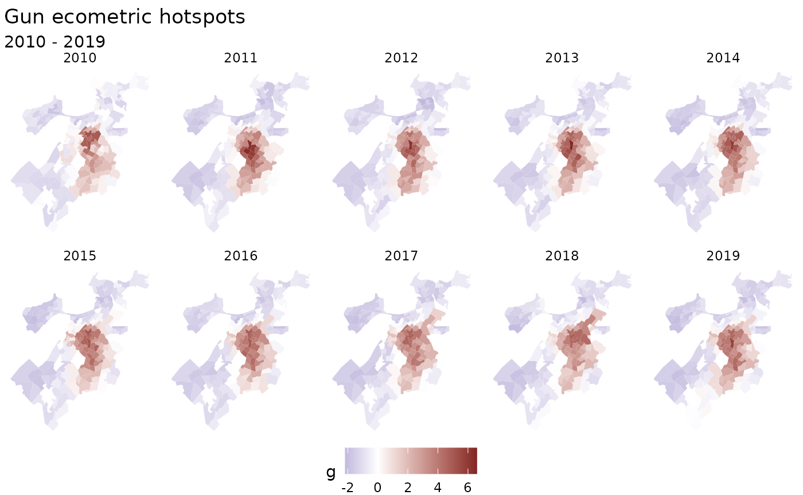
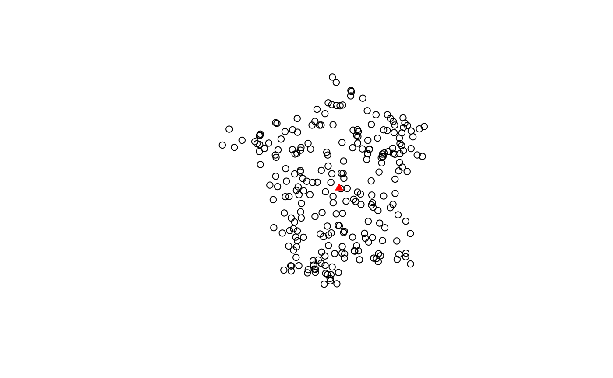

# Version 0.2.0

``` r

library(sfdep)
```

While not too far from the initial CRAN release of sfdep, this version
consists of two sizable additions relating to spatio-temporal analysis
and colocation analysis as well as bug fixes and improvements.
Additional functionality is added regarding point-pattern analysis and
neighbor / weight list utilities. Given the breadth of the additions,
this represents a minor version release.

## Colocation Analysis

This release includes functionality to compute colocation quotients.
This is extremely exciting as this is the first open source
implementation of Colocation Quotients that I am aware of. There are
three types of colocation quotient (CLQ) in this release: the global
CLQ, pairwise CLQ, and local CLQ.

See the [colocation
vignette](https://josiahparry.github.io/articles/colocation-analysis.md)
for a more detailed write up.

There are three new functions for calculating CLQs:

- [`global_colocation()`](https://josiahparry.github.io/sfdep/reference/global_colocation.md)
- [`pairwise_colocation()`](https://josiahparry.github.io/sfdep/reference/pairwise_colocation.md)
- [`local_colocation()`](https://josiahparry.github.io/sfdep/reference/local_colocation.md)

## Spacetime

And probably most notable, is the introduction of a new spacetime class.
This class was created as a byproduct of creating functionality for
emerging hot spot analysis. For a more detailed write up see the
[spacetime
vignette](https://josiahparry.github.io/articles/spacetime-s3.md).

The new functions that are available are:

- [`spacetime()`](https://josiahparry.github.io/sfdep/reference/spacetime.md),
  [`new_spacetime()`](https://josiahparry.github.io/sfdep/reference/spacetime.md),
  [`validate_spacetime()`](https://josiahparry.github.io/sfdep/reference/spacetime.md):
  - Creating spacetime objects
- [`activate()`](https://josiahparry.github.io/sfdep/reference/activate.md),
  [`active()`](https://josiahparry.github.io/sfdep/reference/activate.md):
  - changing spacetime context and determining active context
- [`as_sf()`](https://josiahparry.github.io/sfdep/reference/as_spacetime.md),
  [`as_spacetime()`](https://josiahparry.github.io/sfdep/reference/as_spacetime.md):
  - casting between spacetime and sf objects
- [`is_spacetime()`](https://josiahparry.github.io/sfdep/reference/spacetime.md):
  - determine if an object is a spacetime object
- [`is_spacetime_cube()`](https://josiahparry.github.io/sfdep/reference/is_spacetime_cube.md):
  - determine if a spacetime object is a spatio-temporal full grid aka
    spacetime cube
- [`complete_spacetime_cube()`](https://josiahparry.github.io/sfdep/reference/complete_spacetime_cube.md):
  - if a spatio-temporal sparse grid, add rows to make a spatio-temporal
    full grid (spacetime cube)
- [`set_col()`](https://josiahparry.github.io/sfdep/reference/set_col.md),
  [`set_nbs()`](https://josiahparry.github.io/sfdep/reference/set_col.md),
  [`set_wts()`](https://josiahparry.github.io/sfdep/reference/set_col.md):
  - add columns from geometry context to data context
- [`emerging_hotspot_analysis()`](https://josiahparry.github.io/sfdep/reference/emerging_hotspot_analysis.md):
  - conduct emerging hotspot analysis
- [`spt_update()`](https://josiahparry.github.io/sfdep/reference/spt_update.md):
  - update times and locations attributes of a spacetime object

``` r

df_fp <- system.file("extdata", "bos-ecometric.csv", package = "sfdep")
geo_fp <- system.file("extdata", "bos-ecometric.geojson", package = "sfdep")

# read in data
df <- readr::read_csv(df_fp, col_types = "ccidD")
geo <- sf::st_read(geo_fp)
#> Reading layer `bos-ecometric' from data source 
#>   `/home/runner/work/_temp/Library/sfdep/extdata/bos-ecometric.geojson' 
#>   using driver `GeoJSON'
#> Simple feature collection with 168 features and 1 field
#> Geometry type: POLYGON
#> Dimension:     XY
#> Bounding box:  xmin: -71.19115 ymin: 42.22788 xmax: -70.99445 ymax: 42.3974
#> Geodetic CRS:  NAD83

# create spacetime object
bos <- spacetime(df, geo, ".region_id", "year")

bos
#> spacetime ────
#> Context:`data`
#> 168 locations `.region_id`
#> 10 time periods `year`
#> ── data context ────────────────────────────────────────────────────────────────
#> # A tibble: 1,680 × 5
#>    .region_id  ecometric  year value time_period
#>  * <chr>       <chr>     <int> <dbl> <date>     
#>  1 25025010405 Guns       2010  0.35 2010-01-01 
#>  2 25025010405 Guns       2011  0.89 2011-01-01 
#>  3 25025010405 Guns       2012  1.2  2012-01-01 
#>  4 25025010405 Guns       2013  0.84 2013-01-01 
#>  5 25025010405 Guns       2014  1.5  2014-01-01 
#>  6 25025010405 Guns       2015  1.15 2015-01-01 
#>  7 25025010405 Guns       2016  1.48 2016-01-01 
#>  8 25025010405 Guns       2017  1.64 2017-01-01 
#>  9 25025010405 Guns       2018  0.49 2018-01-01 
#> 10 25025010405 Guns       2019  0.17 2019-01-01 
#> # ℹ 1,670 more rows
```

Spacetime objects have two contexts: data and geometry. Currently the
data is activated. We can activate the geometry context like so:

``` r

activate(bos, "geometry") 
#> spacetime ────
#> Context:`geometry`
#> 168 locations `.region_id`
#> 10 time periods `year`
#> ── geometry context ────────────────────────────────────────────────────────────
#> Simple feature collection with 168 features and 1 field
#> Geometry type: POLYGON
#> Dimension:     XY
#> Bounding box:  xmin: -71.19115 ymin: 42.22788 xmax: -70.99445 ymax: 42.3974
#> Geodetic CRS:  NAD83
#> First 10 features:
#>     .region_id                       geometry
#> 1  25025010405 POLYGON ((-71.09009 42.3466...
#> 2  25025010404 POLYGON ((-71.09066 42.3397...
#> 3  25025010801 POLYGON ((-71.08159 42.3537...
#> 4  25025010702 POLYGON ((-71.07066 42.3518...
#> 5  25025010204 POLYGON ((-71.10683 42.3487...
#> 6  25025010802 POLYGON ((-71.08159 42.3537...
#> 7  25025010104 POLYGON ((-71.08784 42.3474...
#> 8  25025000703 POLYGON ((-71.12622 42.3504...
#> 9  25025000504 POLYGON ((-71.14175 42.3404...
#> 10 25025000704 POLYGON ((-71.13551 42.3487...
```

This is handy because we can find neighbors in our geometry and link
them to our data.

``` r

library(dplyr)
#> 
#> Attaching package: 'dplyr'
#> The following objects are masked from 'package:stats':
#> 
#>     filter, lag
#> The following objects are masked from 'package:base':
#> 
#>     intersect, setdiff, setequal, union

bos_nb <- bos |> 
  activate("geometry") |> 
  mutate(nb = st_contiguity(geometry),
         wt = st_weights(nb))

bos_nb
#> spacetime ────
#> Context:`geometry`
#> 168 locations `.region_id`
#> 10 time periods `year`
#> ── geometry context ────────────────────────────────────────────────────────────
#> Simple feature collection with 168 features and 3 fields
#> Geometry type: POLYGON
#> Dimension:     XY
#> Bounding box:  xmin: -71.19115 ymin: 42.22788 xmax: -70.99445 ymax: 42.3974
#> Geodetic CRS:  NAD83
#> First 10 features:
#>     .region_id                       geometry                                nb
#> 1  25025010405 POLYGON ((-71.09009 42.3466... 2, 72, 93, 94, 108, 143, 144, 166
#> 2  25025010404 POLYGON ((-71.09066 42.3397...                       1, 143, 166
#> 3  25025010801 POLYGON ((-71.08159 42.3537...                     4, 6, 87, 164
#> 4  25025010702 POLYGON ((-71.07066 42.3518...                3, 6, 87, 112, 142
#> 5  25025010204 POLYGON ((-71.10683 42.3487...                         7, 11, 72
#> 6  25025010802 POLYGON ((-71.08159 42.3537...                       3, 4, 7, 87
#> 7  25025010104 POLYGON ((-71.08784 42.3474...                  5, 6, 11, 72, 87
#> 8  25025000703 POLYGON ((-71.12622 42.3504...                       10, 12, 145
#> 9  25025000504 POLYGON ((-71.14175 42.3404...            89, 146, 152, 154, 156
#> 10 25025000704 POLYGON ((-71.13551 42.3487...                  8, 145, 146, 152
#>                                                        wt
#> 1  0.125, 0.125, 0.125, 0.125, 0.125, 0.125, 0.125, 0.125
#> 2                         0.3333333, 0.3333333, 0.3333333
#> 3                                  0.25, 0.25, 0.25, 0.25
#> 4                                 0.2, 0.2, 0.2, 0.2, 0.2
#> 5                         0.3333333, 0.3333333, 0.3333333
#> 6                                  0.25, 0.25, 0.25, 0.25
#> 7                                 0.2, 0.2, 0.2, 0.2, 0.2
#> 8                         0.3333333, 0.3333333, 0.3333333
#> 9                                 0.2, 0.2, 0.2, 0.2, 0.2
#> 10                                 0.25, 0.25, 0.25, 0.25
```

These can be brought over to our data context for further use.

``` r

bos_nb <- bos_nb |> 
  set_wts() |> 
  set_nbs()

bos_nb
#> spacetime ────
#> Context:`data`
#> 168 locations `.region_id`
#> 10 time periods `year`
#> ── data context ────────────────────────────────────────────────────────────────
#> # A tibble: 1,680 × 7
#>    .region_id  ecometric  year value time_period wt        nb       
#>    <chr>       <chr>     <int> <dbl> <date>      <list>    <list>   
#>  1 25025010405 Guns       2010  0.35 2010-01-01  <dbl [8]> <int [8]>
#>  2 25025010404 Guns       2010  0    2010-01-01  <dbl [3]> <int [3]>
#>  3 25025010801 Guns       2010  0    2010-01-01  <dbl [4]> <int [4]>
#>  4 25025010702 Guns       2010  0.46 2010-01-01  <dbl [5]> <int [5]>
#>  5 25025010204 Guns       2010  0    2010-01-01  <dbl [3]> <int [3]>
#>  6 25025010802 Guns       2010  0    2010-01-01  <dbl [4]> <int [4]>
#>  7 25025010104 Guns       2010  0    2010-01-01  <dbl [5]> <int [5]>
#>  8 25025000703 Guns       2010  0    2010-01-01  <dbl [3]> <int [3]>
#>  9 25025000504 Guns       2010  0.22 2010-01-01  <dbl [5]> <int [5]>
#> 10 25025000704 Guns       2010  0    2010-01-01  <dbl [4]> <int [4]>
#> # ℹ 1,670 more rows
```

Then we can group our data set and calculate metrics based on different
years. But this is only possible for data that are spacetime cubes. Read
the spacetime vignette for more. We can check if this object meets the
conditions to be a spacetime cube.

``` r

is_spacetime_cube(bos)
#> [1] TRUE
```

Since this is a spacetime cube, it is safe to perform statistics on each
time slice.

``` r

bos_gs <- bos_nb |> 
  activate("data") |> 
  filter(ecometric == "Guns") |> 
  group_by(year) |> 
  mutate(g = local_g(value, nb, wt))

bos_gs
#> spacetime ────
#> Context:`data`
#> 168 locations `.region_id`
#> 10 time periods `year`
#> ── data context ────────────────────────────────────────────────────────────────
#> # A tibble: 1,680 × 8
#> # Groups:   year [10]
#>    .region_id  ecometric  year value time_period wt        nb             g
#>  * <chr>       <chr>     <int> <dbl> <date>      <list>    <list>     <dbl>
#>  1 25025010405 Guns       2010  0.35 2010-01-01  <dbl [8]> <int [8]> -0.987
#>  2 25025010404 Guns       2010  0    2010-01-01  <dbl [3]> <int [3]> -0.930
#>  3 25025010801 Guns       2010  0    2010-01-01  <dbl [4]> <int [4]> -1.08 
#>  4 25025010702 Guns       2010  0.46 2010-01-01  <dbl [5]> <int [5]> -1.04 
#>  5 25025010204 Guns       2010  0    2010-01-01  <dbl [3]> <int [3]> -0.864
#>  6 25025010802 Guns       2010  0    2010-01-01  <dbl [4]> <int [4]> -1.08 
#>  7 25025010104 Guns       2010  0    2010-01-01  <dbl [5]> <int [5]> -1.33 
#>  8 25025000703 Guns       2010  0    2010-01-01  <dbl [3]> <int [3]> -1.02 
#>  9 25025000504 Guns       2010  0.22 2010-01-01  <dbl [5]> <int [5]> -1.34 
#> 10 25025000704 Guns       2010  0    2010-01-01  <dbl [4]> <int [4]> -1.25 
#> # ℹ 1,670 more rows
```

Now that the measure has been calculated for each timeslice, we can
connect the geometries for each time slice for the purpose of
visualization.

> Note that the spacetime class’ objective is to avoid geometry
> duplication. But it is necessary for visualization with ggplot2.

We can cast to an sf object with
[`as_sf()`](https://josiahparry.github.io/sfdep/reference/as_spacetime.md).

``` r

library(ggplot2)

# cast to sf object. Uses merge under the hood
# so if duplicate columns exist, we can specify suffix names
as_sf(bos_gs, suffixes = c("_geo", "_data")) |>
  ggplot(aes(fill = g)) +
  geom_sf(color = NA) +
  facet_wrap("year", nrow = 2) +
  scale_fill_gradient2(
    high = scales::muted("red"),
    low = scales::muted("blue")
    ) + 
  labs(title = "Gun ecometric hotspots",
       subtitle = "2010 - 2019") + 
  theme_void() +
  theme(legend.position = "bottom")
```



> Note that the holes are due to missing data in the original dataset.

## Point Pattern analysis

There were a few additional functions added which pertain to point
pattern analysis. Namely regarding finding centers and creating ellipses
based on the centers. These functions supplement gaps in other spatial
analysis libraries such as spatstat.

``` r

library(sf)
#> Linking to GEOS 3.12.1, GDAL 3.8.4, PROJ 9.4.0; sf_use_s2() is TRUE
library(sfdep)

pnts <- st_sample(guerry, 250)
```

We can calculate the euclidean median center and plot it over all the
points.

``` r

cent <- euclidean_median(pnts)

plot(pnts)
plot(cent, col = "red", pch = 17, add = TRUE)
```



Additionally, we can identify the standard deviational ellipse for our
point set.

``` r

ellip_cent <- std_dev_ellipse(pnts)

ellip <- st_ellipse(ellip_cent, 
           ellip_cent$sx, 
           ellip_cent$sy, 
           ellip_cent$theta) 

plot(ellip)
plot(pnts, add = TRUE)
```


