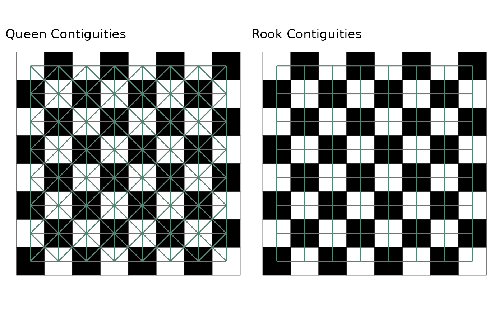
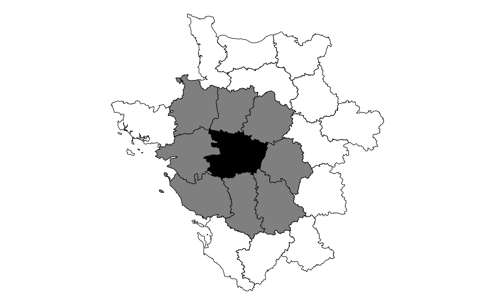
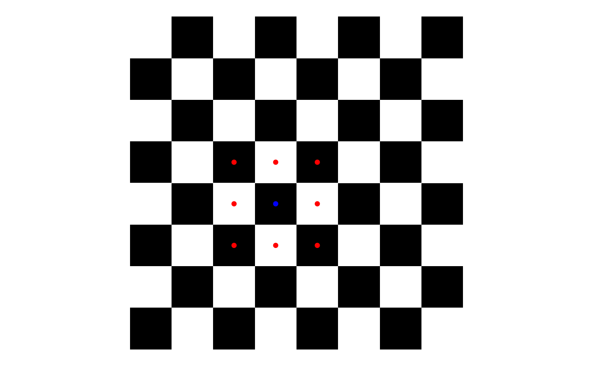

# The Basics of sfdep

``` r

library(sfdep)
library(dplyr)
library(ggplot2)
```

The goal of this vignette is to familiarize you with the basics of
sfdep:

- creating neighbors
- creating weights
- calculating a LISA
- 

## Intro / what is spatial relationship

sfdep provides users with a way to conduct “Exploratory Spatial Data
Analysis”, or ESDA for short. ESDA differs from typical exploratory data
analysis in that we are strictly exploring spatial relationships. As you
might have guessed, ESDA evaluates whether the phenomena captured in
your data are dependent upon space–or are spatially auto-correlated.
Much of ESDA is focused on “Local Indicators of Spatial Association”,
LISAs for short. LISAs are measures that are developed to identify
whether some observed pattern is truly random or impacted by its
relationship in space.

Much of the philosophy of LISAs and ESDA are captured in Tobler’s First
Law of Geography

> “Everything is related to everything else. But near things are more
> related than distant things.” - Waldo R. Tobler, 1969

It’s tough to state this any more simply. Things that are next to each
other tend to be more similar than things that are further away.

To assess whether near things are related and further things less so, we
typically **lattice data**. A lattice is created when a landscape or
region is divided into sub-areas. Most naturally, these types of data
are represented as vector polygons.

## Neighbors

To describe neighbors I’m going to steal extensively from my own post
[“Understanding Spatial
Autocorrelation”](https://www.urban-informatics.org/tutorials/2021-05-07-spatial-autocorrelation-in-r/).

If we assume that there is a spatial relationship in our data, we are
taking on the belief that our data are not completely independent of
each other. If nearer things are more related, then census tracts that
are close to each other will have similar values.

In order to evaluate whether nearer things are related, we must know
what observations are nearby. With polygon data we identify neighbors
based on their contiguity. To be contiguous means to be connected or
touching—think of the *contiguous* lower 48 states.

### Contiguities

The two most common contiguities are based on the game of chess. Let’s
take a simple chess board.


In chess each piece can move in a different way. All pieces, with the
exception of the knight, move either diagonally or horizontally and
vertically. The most common contiguities are queen and rook
contiguities. In chess, a queen can move diagonally and horizontal and
vertically whereas a rook can only move horizontal and vertically.



We extend this idea to polygons. Queen contiguities identify neighbors
based on any polygon that is touching. With rook contiguities, we
identify neighbors based on polygons that touch on the side. For most
social science research, we only need to be concerned with queen
contiguities.

While a chess board might make intuitive sense, geographies are really
wonky in real life. Below is map of the 47th observation in the `guerry`
object and it’s queen contiguity neighbors.



You can see that any polygon that is touching, even at a corner, will be
considered a neighbor to the point in question. This will be done for
*every* polygon in our data set.

## Understanding the spatial weights

Once neighbors are identified, they can then be used to calculate
**spatial weights**. The typical method of calculating the spatial
weights is through row standardization (`st_weights(nb, style = "W")`).
Each neighbor that touches our census tract will be assigned an equal
weight. We do this by assigning each neighbor a value of 1 then dividing
by the number of neighbors. If we have 5 neighboring census tracts, each
of them will have a spatial weight of 0.2 (1 / 5 = 0.2).

Going back to the chess board example, we can take the position d4 and
look at the queen contiguities. There are 8 squares that immediately
touch the square. Each one of these squares is considered a neighbor and
given a value of 1. Then each square is divided by the total number or
neighbors, 8.

 Very simply
it looks like the following

``` r

(d4_nbs <- rep(1, 8))
#> [1] 1 1 1 1 1 1 1 1

d4_nbs / length(d4_nbs)
#> [1] 0.125 0.125 0.125 0.125 0.125 0.125 0.125 0.125
```

## Creating Neighbors and Weights

sfdep utilizes list objects for both neighbors and weights. The
neighbors and weights lists.

To identify contiguity-based neighbors, we use
[`st_contiguity()`](https://josiahparry.github.io/sfdep/reference/st_contiguity.md)
on the sf geometry column. And to calculate the weights from the
neighbors list, we use
[`st_weights()`](https://josiahparry.github.io/sfdep/reference/st_weights.md)
on the resultant neighbors list. By convention these are typically
called `nb` and `wt`.

These lists can be created line by line or within a pipe. The most
common usecase is likely via a dplyr pipeline.

``` r

guerry_nb <- guerry %>% 
  mutate(nb = st_contiguity(geometry),
         wt = st_weights(nb),
         .before = 1) # to put them in the front

guerry_nb
#> Simple feature collection with 85 features and 28 fields
#> Geometry type: MULTIPOLYGON
#> Dimension:     XY
#> Bounding box:  xmin: 47680 ymin: 1703258 xmax: 1031401 ymax: 2677441
#> CRS:           NA
#> # A tibble: 85 × 29
#>    nb        wt    code_dept count ave_id_geo  dept region department crime_pers
#>  * <nb>      <lis> <fct>     <dbl>      <dbl> <int> <fct>  <fct>           <int>
#>  1 <int [4]> <dbl> 01            1         49     1 E      Ain             28870
#>  2 <int [6]> <dbl> 02            1        812     2 N      Aisne           26226
#>  3 <int [6]> <dbl> 03            1       1418     3 C      Allier          26747
#>  4 <int [4]> <dbl> 04            1       1603     4 E      Basses-Al…      12935
#>  5 <int [3]> <dbl> 05            1       1802     5 E      Hautes-Al…      17488
#>  6 <int [7]> <dbl> 07            1       2249     7 S      Ardeche          9474
#>  7 <int [3]> <dbl> 08            1      35395     8 N      Ardennes        35203
#>  8 <int [3]> <dbl> 09            1       2526     9 S      Ariege           6173
#>  9 <int [5]> <dbl> 10            1      34410    10 E      Aube            19602
#> 10 <int [5]> <dbl> 11            1       2807    11 S      Aude            15647
#> # ℹ 75 more rows
#> # ℹ 20 more variables: crime_prop <int>, literacy <int>, donations <int>,
#> #   infants <int>, suicides <int>, main_city <ord>, wealth <int>,
#> #   commerce <int>, clergy <int>, crime_parents <int>, infanticide <int>,
#> #   donation_clergy <int>, lottery <int>, desertion <int>, instruction <int>,
#> #   prostitutes <int>, distance <dbl>, area <int>, pop1831 <dbl>,
#> #   geometry <MULTIPOLYGON>
```

## Calculating LISAs

To calculate LISAs we typically will provide a numeric object(s), a
neighbor list, and a weights list–and often the argument `nsim` to
determine the number of simulations to run. Most LISAs return a data
frame of the same number of rows as the input dataframe. The resultant
data frame can be unnested, or columns hoisted for ease of analysis.

For example to calculate the Local Moran we use the function
[`local_moran()`](https://josiahparry.github.io/sfdep/reference/local_moran.md)

``` r

lisa <- guerry_nb %>% 
  mutate(local_moran = local_moran(crime_pers, nb, wt, nsim = 199),
         .before = 1)

lisa
#> Simple feature collection with 85 features and 29 fields
#> Geometry type: MULTIPOLYGON
#> Dimension:     XY
#> Bounding box:  xmin: 47680 ymin: 1703258 xmax: 1031401 ymax: 2677441
#> CRS:           NA
#> # A tibble: 85 × 30
#>    local_moran$ii nb    wt    code_dept count ave_id_geo  dept region department
#>  *          <dbl> <nb>  <lis> <fct>     <dbl>      <dbl> <int> <fct>  <fct>     
#>  1         0.522  <int> <dbl> 01            1         49     1 E      Ain       
#>  2         0.828  <int> <dbl> 02            1        812     2 N      Aisne     
#>  3         0.804  <int> <dbl> 03            1       1418     3 C      Allier    
#>  4         0.742  <int> <dbl> 04            1       1603     4 E      Basses-Al…
#>  5         0.231  <int> <dbl> 05            1       1802     5 E      Hautes-Al…
#>  6         0.839  <int> <dbl> 07            1       2249     7 S      Ardeche   
#>  7         0.623  <int> <dbl> 08            1      35395     8 N      Ardennes  
#>  8         1.65   <int> <dbl> 09            1       2526     9 S      Ariege    
#>  9        -0.0198 <int> <dbl> 10            1      34410    10 E      Aube      
#> 10         0.695  <int> <dbl> 11            1       2807    11 S      Aude      
#> # ℹ 75 more rows
#> # ℹ 32 more variables: local_moran$eii <dbl>, $var_ii <dbl>, $z_ii <dbl>,
#> #   $p_ii <dbl>, $p_ii_sim <dbl>, $p_folded_sim <dbl>, $skewness <dbl>,
#> #   $kurtosis <dbl>, $mean <fct>, $median <fct>, $pysal <fct>,
#> #   crime_pers <int>, crime_prop <int>, literacy <int>, donations <int>,
#> #   infants <int>, suicides <int>, main_city <ord>, wealth <int>,
#> #   commerce <int>, clergy <int>, crime_parents <int>, infanticide <int>, …
```

Now that we have a data frame, we need to unnest it.

``` r

lisa %>% 
  tidyr::unnest(local_moran)
#> Simple feature collection with 85 features and 40 fields
#> Geometry type: MULTIPOLYGON
#> Dimension:     XY
#> Bounding box:  xmin: 47680 ymin: 1703258 xmax: 1031401 ymax: 2677441
#> CRS:           NA
#> # A tibble: 85 × 41
#>         ii      eii   var_ii   z_ii    p_ii p_ii_sim p_folded_sim skewness
#>      <dbl>    <dbl>    <dbl>  <dbl>   <dbl>    <dbl>        <dbl>    <dbl>
#>  1  0.522  -0.0753  0.396     0.950 0.342       0.35        0.175  -0.0363
#>  2  0.828  -0.0203  0.130     2.35  0.0185      0.03        0.015   0.156 
#>  3  0.804  -0.0120  0.136     2.21  0.0272      0.05        0.025   0.269 
#>  4  0.742   0.0432  0.230     1.46  0.145       0.15        0.075  -0.0116
#>  5  0.231  -0.0165  0.0336    1.35  0.177       0.19        0.095  -0.167 
#>  6  0.839  -0.0190  0.298     1.57  0.116       0.1         0.05   -0.0892
#>  7  0.623  -0.246   1.39      0.736 0.462       0.44        0.22    0.271 
#>  8  1.65   -0.228   1.22      1.70  0.0894      0.11        0.055  -0.0626
#>  9 -0.0198  0.00226 0.000525 -0.961 0.337       0.33        0.165  -0.0471
#> 10  0.695  -0.0399  0.0730    2.72  0.00653     0.01        0.005  -0.219 
#> # ℹ 75 more rows
#> # ℹ 33 more variables: kurtosis <dbl>, mean <fct>, median <fct>, pysal <fct>,
#> #   nb <nb>, wt <list>, code_dept <fct>, count <dbl>, ave_id_geo <dbl>,
#> #   dept <int>, region <fct>, department <fct>, crime_pers <int>,
#> #   crime_prop <int>, literacy <int>, donations <int>, infants <int>,
#> #   suicides <int>, main_city <ord>, wealth <int>, commerce <int>,
#> #   clergy <int>, crime_parents <int>, infanticide <int>, …
```

This can then be used for visualization or further analysis.

Additionally, for other LISAs that can take any number of inputs, e.g. 3
or more numeric variables, we provide this as a list. Take for example
the Local C statistic.

``` r

guerry_nb %>% 
  mutate(local_c = local_c_perm(list(crime_pers, wealth), nb, wt), 
         .before = 1) %>% 
  tidyr::unnest(local_c)
#> Simple feature collection with 85 features and 38 fields
#> Geometry type: MULTIPOLYGON
#> Dimension:     XY
#> Bounding box:  xmin: 47680 ymin: 1703258 xmax: 1031401 ymax: 2677441
#> CRS:           NA
#> # A tibble: 85 × 39
#>       ci cluster   e_ci var_ci   z_ci   p_ci p_ci_sim p_folded_sim skewness
#>    <dbl> <fct>    <dbl>  <dbl>  <dbl>  <dbl>    <dbl>        <dbl>    <dbl>
#>  1 1.53  Positive  2.46  0.683 -1.12  0.265     0.272        0.136   0.164 
#>  2 0.500 Positive  1.75  0.398 -1.98  0.0479    0.012        0.006   0.400 
#>  3 0.642 Positive  1.66  0.257 -2.01  0.0442    0.032        0.016   0.203 
#>  4 0.324 Positive  2.31  0.795 -2.23  0.0261    0.016        0.008   0.318 
#>  5 0.298 Positive  2.29  0.872 -2.14  0.0325    0.016        0.008   0.278 
#>  6 1.60  Positive  3.36  0.779 -1.99  0.0469    0.052        0.026   0.0419
#>  7 2.04  Positive  3.22  1.67  -0.907 0.364     0.424        0.212   0.317 
#>  8 2.20  Positive  3.36  1.92  -0.838 0.402     0.428        0.214   0.328 
#>  9 0.507 Positive  1.69  0.375 -1.92  0.0544    0.044        0.022   0.230 
#> 10 1.46  Positive  1.76  0.469 -0.434 0.664     0.712        0.356   0.453 
#> # ℹ 75 more rows
#> # ℹ 30 more variables: kurtosis <dbl>, nb <nb>, wt <list>, code_dept <fct>,
#> #   count <dbl>, ave_id_geo <dbl>, dept <int>, region <fct>, department <fct>,
#> #   crime_pers <int>, crime_prop <int>, literacy <int>, donations <int>,
#> #   infants <int>, suicides <int>, main_city <ord>, wealth <int>,
#> #   commerce <int>, clergy <int>, crime_parents <int>, infanticide <int>,
#> #   donation_clergy <int>, lottery <int>, desertion <int>, instruction <int>, …
```
