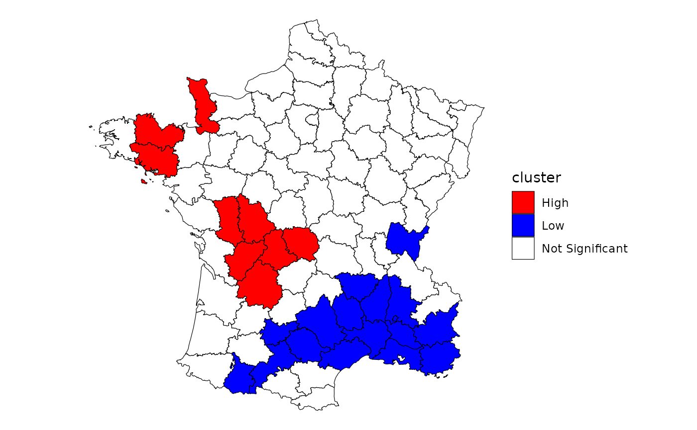
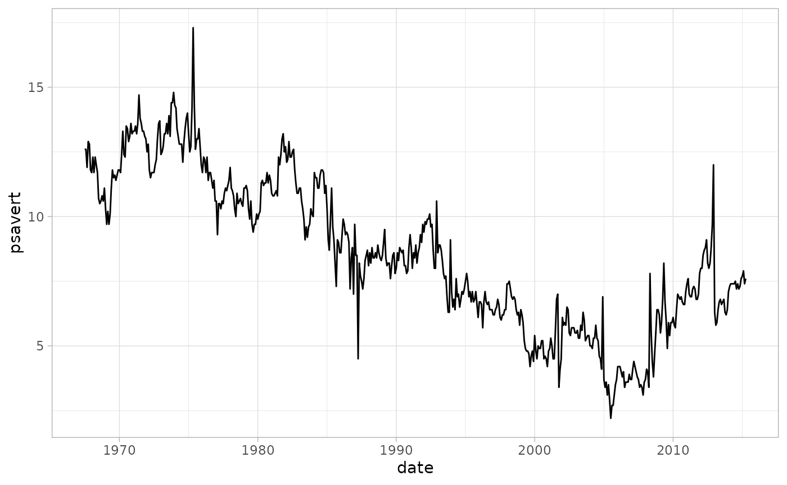
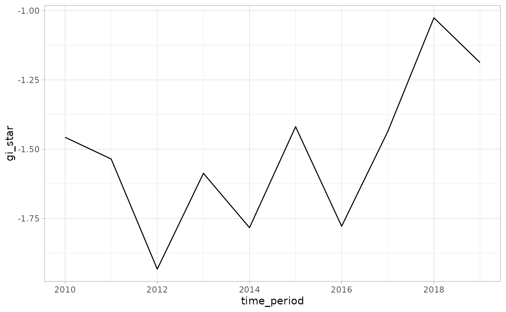

# Emerging Hot Spot Analysis

Emerging hot spot Analysis (EHSA) is a technique that falls under
exploratory spatial data analysis (ESDA). It combines the traditional
ESDA technique of hot spot analysis using the Getis-Ord Gi\* statistic
with the traditional time-series Mann-Kendall test for monotonic trends.

The goal of EHSA is to evaluate how hot and cold spots are changing over
time. It helps us answer the questions: are they becoming increasingly
hotter, are they cooling down, or are they staying the same?

In brief, EHSA works by calculating the Gi\* for each time period. The
series of Gi\* at each location is treated as a time-series and
evaluated for a trend using the Mann-Kendall statistic. The Gi\* and the
Mann-Kendall are compared together to create 17 unique classifications
to help better understand how the locations have changed over time.

In this vignette we walk through the Getis-Ord Gi\*, the Mann-Kendall,
and how the two work together to in EHSA.

## Gettis-Ord Gi\*

The Gettis-Ord Gi and Gi\* (pronounced gee-eye-star) are one of the
earliest LISAs. The Gi and Gi\* measures are typically reported as a
Z-score where high values indicate a high-high cluster and negative
Z-scores indicate a low-low cluster. There are no high-low and low-high
classifications like the local Moran.

“The Gi statistic consist of a ratio of the weighted average of the
values in the neighboring locations, to the sum of all values, not
including the value at the location ($`x_i`$)” ([Local Spatial
Autocorrelation (2), GeoDa
Center](https://geodacenter.github.io/workbook/6b_local_adv/lab6b.html#getis-ord-statistics)).

``` math
G_i = \frac{\sum_{j \ne i}W_{ij}X_j}
          {\sum_{j \ne i}X_j}
```

The Gi\* statistic includes the focal (or self, or i^(th)) observation
in the neighborhood.

``` math
G_i* = \frac{\sum_{j}W_{ij}X_j}
          {\sum_{j}X_j}
```

### Calculating the local Gi\*

To calculate the local Gi\* using sfdep, we have to be especially aware
of the neighbors list when we create it. By default, when we create a
neighbors list, we exclude the self from the neighbors list because it
seems a little silly to say “I am my own neighbor.” However, if we want
to calculate the local Gi\*, we must be sure to explicitly add it using
[`include_self()`](https://josiahparry.github.io/sfdep/reference/include_self.md)

Here, we follow the example laid out by the GeoDa center documentation
to calculate and plot the local Gi\* statistic for donations using the
Guerry dataset.

First we create a neighbor list ensuring that the self is included and
then create the weights list from the new neighbors list.

``` r

library(sfdep)
library(dplyr)

guerry_nb <- guerry |> 
  mutate(
    nb = include_self(st_contiguity(geometry)),
         wt = st_weights(nb)
    ) 
```

Following, we calculate the local Gi\* using
[`local_gstar_perm()`](https://josiahparry.github.io/sfdep/reference/local_gstar.md)
on the `donations` column which creates a new data frame column called
`gi_star`. We then unnest it using
[`tidyr::unnest()`](https://tidyr.tidyverse.org/reference/unnest.html).

``` r

donat_gistar <- guerry_nb |> 
  transmute(gi_star = local_gstar_perm(donations, nb, wt, nsim = 199)) |> 
  tidyr::unnest(gi_star)

donat_gistar
#> Simple feature collection with 85 features and 10 fields
#> Geometry type: MULTIPOLYGON
#> Dimension:     XY
#> Bounding box:  xmin: 47680 ymin: 1703258 xmax: 1031401 ymax: 2677441
#> CRS:           NA
#> # A tibble: 85 × 11
#>    gi_star cluster   e_gi     var_gi std_dev p_value p_sim p_folded_sim skewness
#>      <dbl> <fct>    <dbl>      <dbl>   <dbl>   <dbl> <dbl>        <dbl>    <dbl>
#>  1  -1.49  Low     0.0116 0.0000137   -1.44   0.151   0.03        0.015    0.627
#>  2  -0.482 High    0.0123 0.00000830  -0.688  0.492   0.53        0.265    0.439
#>  3   0.652 High    0.0129 0.00000870   0.298  0.766   0.78        0.39     0.382
#>  4  -1.65  Low     0.0103 0.0000132   -1.27   0.203   0.1         0.05     0.864
#>  5  -1.08  High    0.0122 0.0000165   -1.22   0.223   0.13        0.065    1.05 
#>  6  -2.38  Low     0.0111 0.00000737  -2.26   0.0237  0.01        0.005    0.568
#>  7  -0.362 Low     0.0110 0.0000111   -0.231  0.817   0.89        0.445    0.969
#>  8  -0.720 Low     0.0108 0.0000157   -0.503  0.615   0.73        0.365    0.828
#>  9  -1.45  Low     0.0107 0.0000111   -1.15   0.252   0.25        0.125    0.827
#> 10  -1.32  Low     0.0109 0.0000129   -0.984  0.325   0.27        0.135    0.881
#> # ℹ 75 more rows
#> # ℹ 2 more variables: kurtosis <dbl>, geometry <MULTIPOLYGON>
```

Lastly, we classify the clusters using a combination of
[`mutate()`](https://dplyr.tidyverse.org/reference/mutate.html) and
[`case_when()`](https://dplyr.tidyverse.org/reference/case-and-replace-when.html)
which is then piped into a ggplot map. While not a perfect recreation of
the GeoDa map, it is very close—the differences likely due to
conditional permutation (see [conditional permutation
vignette](https://josiahparry.github.io/articles/conditional-permutation.md)
for more on significance calculation).

``` r

library(ggplot2)

donat_gistar |> 
  mutate(cluster = case_when(
    p_folded_sim > 0.05 ~ "Not Significant",
    p_folded_sim <= 0.05 & gi_star < 0 ~ "Low",
    p_folded_sim <= 0.05 & gi_star > 0 ~ "High"
  )) |> 
  ggplot(aes(fill = cluster)) +
  geom_sf(lwd = 0.2, color = "black") +
  scale_fill_manual(values = c("High" = "red",
                               "Low" = "Blue", 
                               "Not Significant" = "white")) +
  theme_void()
```



In EHSA, we calculate this statistic for each time period.

## Mann-Kendall Test

With the calculations of the local Gi\* for each unit of time for every
geography, we can evaluate how the hotspots change over time. We
incorporate time-series analysis through the use of the Mann-Kendall
(MK) Trend test. The MK test is a nonparametric test that checks for
monotonic trends.

If you don’t recall the term monotonic from your calculus class, that’s
okay. A monotonic series or function is one that only increases (or
decreases) and never changes direction. So long as the function either
stays flat or continues to increase, it is monotonic.

The benefit of the test being nonparametric is that the trend can be
non-linear. And further, the MK test does not check if a time-series is
strictly monotonic—e.g. every subsequent unit is increasing or
decreasing—but if the overall series is increasing or decreasing.

Below is an example of a monotonic upward trend which is not linear.

``` r

series <- c(0, 1, 1.4, 1.5, 1.6, 5, 5, 5.5, 8, seq(8, 8.5, length.out = 5))

plot(series, type = "l")
```


For a more realistic example, let’s take a look a the `economics`
dataset from `ggplot2` which contains data from FRED. We’ll use the
`psavert` variable which contains data about personal savings rates in
the United States.

``` r

econ <- ggplot2::economics

ggplot(econ, aes(date, psavert)) +
  geom_line() +
  theme_light()
```



From a visual inspection, we can tell that overall the trend is
decreasing. The MK test can confirm this. We use
[`Kendall::MannKendall()`](https://rdrr.io/pkg/Kendall/man/MannKendall.html)
to test if the trend is significantly decreasing.

``` r

Kendall::MannKendall(econ$psavert)
#> tau = -0.644, 2-sided pvalue =< 2.22e-16
```

The above results show the `tau` and p-value. Tau ranges between -1 and
1 where -1 is a perfectly decreasing series and 1 is a perfectly
increasing series. The p-value is extremely small indicating that the
null-hypothesis (that there is no trend) can be rejected. The tau is
-0.64 which indicates a moderate downward trend.

## The whole game

We’ve gone over briefly the local Gi\* and the Mann-Kendall Test. EHSA
combines the both of these to evaluate if there are trends in hot or
cold spots over time.

EHSA utilizes a spacetime cube, or spatio-temporal full grid. Please see
[spacetime
vignette](https://josiahparry.github.io/articles/spacetime-s3.md) for
more on spacetime representations. In short, a spacetime cube contains a
regular time-series for each location in a dataset—i.e. there are
$`n \times m`$ observations where n is the number of locations and m is
the number of times.

For each time-slice (i.e. the complete set of geometries for a given
time) the local Gi\* is calculated. Say we have 10 times, we will have
for each i $`G_{i,t=1}^*, \ldots, G_{i,t=10}^*`$.

Then, given each location’s time-series of Gi\*, they are assessed using
the MK test.

## A hands on example

We can compute the EHSA manually using sfdep and spacetime classes. In
this example we utilize
[Ecometric](https://ui.josiahparry.com/ecometrics.html#ecometrics) Data
from the Boston Area Research Initiative ([data and
documentation)](https://dataverse.harvard.edu/dataset.xhtml?persistentId=doi:10.7910/DVN/XTEJRE).
These data are generated from 911 calls in Boston from 2010 - 2020 and
aggregated to the Census Block Group (CBG) level. The column `value`
indicates the calculated prevalence which is derived from Exploratory
Factor Analysis and population projections.

### Data

The data are stored in the internal data file `bos-ecometric.csv` and
`bos-ecometric.geojson`. We will read these in to `df` and `geo` and
will create a new spacetime object called `bos` with them.

> Note: 2022-05-31 this data is available only in the development
> version, so please install with
> `remotes::install_github("josiahparry/sfdep")`.

``` r

# Create objects to store file paths 
df_fp <- system.file("extdata", "bos-ecometric.csv", package = "sfdep")
geo_fp <- system.file("extdata", "bos-ecometric.geojson", package = "sfdep")

# read in data 
df <- readr::read_csv(df_fp, col_types = "ccidD")
geo <- sf::st_read(geo_fp)
#> Reading layer `bos-ecometric' from data source 
#>   `/home/runner/work/_temp/Library/sfdep/extdata/bos-ecometric.geojson' 
#>   using driver `GeoJSON'
#> Simple feature collection with 168 features and 1 field
#> Geometry type: POLYGON
#> Dimension:     XY
#> Bounding box:  xmin: -71.19115 ymin: 42.22788 xmax: -70.99445 ymax: 42.3974
#> Geodetic CRS:  NAD83


# Create spacetime object called `bos`
bos <- spacetime(df, geo, 
                 .loc_col = ".region_id",
                 .time_col = "time_period")

bos
#> spacetime ────
#> Context:`data`
#> 168 locations `.region_id`
#> 10 time periods `time_period`
#> ── data context ────────────────────────────────────────────────────────────────
#> # A tibble: 1,680 × 5
#>    .region_id  ecometric  year value time_period
#>  * <chr>       <chr>     <int> <dbl> <date>     
#>  1 25025010405 Guns       2010  0.35 2010-01-01 
#>  2 25025010405 Guns       2011  0.89 2011-01-01 
#>  3 25025010405 Guns       2012  1.2  2012-01-01 
#>  4 25025010405 Guns       2013  0.84 2013-01-01 
#>  5 25025010405 Guns       2014  1.5  2014-01-01 
#>  6 25025010405 Guns       2015  1.15 2015-01-01 
#>  7 25025010405 Guns       2016  1.48 2016-01-01 
#>  8 25025010405 Guns       2017  1.64 2017-01-01 
#>  9 25025010405 Guns       2018  0.49 2018-01-01 
#> 10 25025010405 Guns       2019  0.17 2019-01-01 
#> # ℹ 1,670 more rows
```

### Local Gi\*

The first step in EHSA is to calculate the local Gi\* for each time
period. But that, however, requires a couple of preceding steps. Before
we calculate Gi\* we need to identify neighbors and weights.

To do this, we activate the geometry context and create two new columns
`nb` and `wt`. Then we will activate the data context again and copy
over the nb and wt columns to each time-slice using
[`set_nbs()`](https://josiahparry.github.io/sfdep/reference/set_col.md)
and
[`set_wts()`](https://josiahparry.github.io/sfdep/reference/set_col.md)—**row
order is very important** so do not rearrange the observations after
using
[`set_nbs()`](https://josiahparry.github.io/sfdep/reference/set_col.md)
or
[`set_wts()`](https://josiahparry.github.io/sfdep/reference/set_col.md).

``` r

bos_nb <- bos |> 
  activate("geometry") |> 
  mutate(
    nb = include_self(st_contiguity(geometry)),
    wt = st_weights(nb)
  ) |> 
  set_nbs("nb") |> 
  set_wts("wt")

head(bos_nb)
#> spacetime ────
#> Context:`data`
#> 168 locations `.region_id`
#> 10 time periods `time_period`
#> ── data context ────────────────────────────────────────────────────────────────
#> # A tibble: 6 × 7
#>   .region_id  ecometric  year value time_period nb        wt       
#>   <chr>       <chr>     <int> <dbl> <date>      <list>    <list>   
#> 1 25025010405 Guns       2010  0.35 2010-01-01  <int [9]> <dbl [9]>
#> 2 25025010404 Guns       2010  0    2010-01-01  <int [4]> <dbl [4]>
#> 3 25025010801 Guns       2010  0    2010-01-01  <int [5]> <dbl [5]>
#> 4 25025010702 Guns       2010  0.46 2010-01-01  <int [6]> <dbl [6]>
#> 5 25025010204 Guns       2010  0    2010-01-01  <int [4]> <dbl [4]>
#> 6 25025010802 Guns       2010  0    2010-01-01  <int [5]> <dbl [5]>
```

This dataset now has neighbors and weights for each time-slice. We can
use these new columns to manually calculate the local Gi\* for each
location. We can do this by grouping by `time_period` and using
[`local_gstar_perm()`](https://josiahparry.github.io/sfdep/reference/local_gstar.md).
After which, we unnest the new data frame column `gi_star`.

``` r

gi_stars <- bos_nb |> 
  group_by(time_period) |> 
  mutate(gi_star = local_gstar_perm(value, nb, wt)) |> 
  tidyr::unnest(gi_star)


gi_stars |> 
  select(.region_id, time_period, gi_star, p_folded_sim)
#> # A tibble: 1,680 × 4
#> # Groups:   time_period [10]
#>    .region_id  time_period gi_star p_folded_sim
#>    <chr>       <date>        <dbl>        <dbl>
#>  1 25025010405 2010-01-01   -0.987        0.136
#>  2 25025010404 2010-01-01   -1.37         0.162
#>  3 25025010801 2010-01-01   -1.48         0.102
#>  4 25025010702 2010-01-01   -0.863        0.12 
#>  5 25025010204 2010-01-01   -1.32         0.2  
#>  6 25025010802 2010-01-01   -1.48         0.1  
#>  7 25025010104 2010-01-01   -1.68         0.058
#>  8 25025000703 2010-01-01   -1.44         0.126
#>  9 25025000504 2010-01-01   -1.42         0.038
#> 10 25025000704 2010-01-01   -1.62         0.046
#> # ℹ 1,670 more rows
```

With these Gi\* measures we can then evaluate each location for a trend
using the Mann-Kendall test.

### Mann-Kendall Test

Let’s first take only a single location, `25025010403`, and evaluate the
Mann-Kendall statistic for it by hand. Then we can extend this to each
location.

> Note that there is a bit of finagling the MK test to make it work
> nicely in a dplyr::summarise() call.

``` r

cbg <- gi_stars |> 
  ungroup() |> 
  filter(.region_id == "25025010403") |> 
  select(.region_id, time_period, year, gi_star)
```

We can also visualized this trend.

``` r

# visualize trend
ggplot(cbg, aes(time_period, gi_star)) +
  geom_line() +
  theme_light()
```



``` r

cbg |> 
  summarise(mk = list(unclass(Kendall::MannKendall(gi_star)))) |> 
  tidyr::unnest_wider(mk)
#> # A tibble: 1 × 5
#>     tau    sl     S     D  varS
#>   <dbl> <dbl> <dbl> <dbl> <dbl>
#> 1 0.378 0.152    17    45   125
```

In the above result, `sl` is the p-value. This result tells us that
there is a slight upward but insignificant trend.

We can replicate this for each location by using
[`group_by()`](https://dplyr.tidyverse.org/reference/group_by.html).

``` r

ehsa_manual <- gi_stars |> 
  group_by(.region_id) |> 
  summarise(mk = list(unclass(Kendall::MannKendall(gi_star)))) |> 
  tidyr::unnest_wider(mk)

# arrange to show significant emerging hot/cold spots
emerging <- ehsa_manual |> 
  arrange(sl, abs(tau)) |> 
  slice(1:5)

# show top 5 locations
emerging
#> # A tibble: 5 × 6
#>   .region_id     tau        sl     S     D  varS
#>   <chr>        <dbl>     <dbl> <dbl> <dbl> <dbl>
#> 1 25025120201 -1     0.0000830   -45    45   125
#> 2 25025090700  0.822 0.00128      37    45   125
#> 3 25025060600  0.733 0.00421      33    45   125
#> 4 25025100601 -0.733 0.00421     -33    45   125
#> 5 25025000201 -0.689 0.00729     -31    45   125
```

Here we can see there are a few locations that are becoming
significantly colder and others that are becoming significantly warmer.

## Using `emerging_hotspot_analysis()`

While we can do the calculations manually as above, this is limited in
two ways. Primarily that in the above example we used spatial neighbors
only. Whereas in EHSA we can—and likely should—incorporate the time-lag
of our spatial neighbors. Secondly, there are classifications proposed
by ESRI which help us understand how each location is changing over
time. Both of these are handled by the
[`emerging_hotspot_analysis()`](https://josiahparry.github.io/sfdep/reference/emerging_hotspot_analysis.md)
function.

This
[`emerging_hotspot_analysis()`](https://josiahparry.github.io/sfdep/reference/emerging_hotspot_analysis.md)
takes a spacetime object `x`, and the quoted name of the variable of
interested in `.var` at minimum. We can specify the number of time lags
using the argument `k` which is set to 1 by default.

``` r

# conduct EHSA
ehsa <- emerging_hotspot_analysis(
  x = bos, 
  .var = "value", 
  k = 1, 
  nsim = 99
)

# preview some values 
head(ehsa)
#> # A tibble: 6 × 4
#>   location       tau p_value classification   
#>   <chr>        <dbl>   <dbl> <chr>            
#> 1 25025010405  0.111  0.721  sporadic coldspot
#> 2 25025010404 -0.333  0.210  sporadic coldspot
#> 3 25025010801 -0.200  0.474  sporadic coldspot
#> 4 25025010702 -0.600  0.0200 sporadic coldspot
#> 5 25025010204 -0.467  0.0736 sporadic coldspot
#> 6 25025010802 -0.333  0.210  sporadic coldspot

# evaluate the classifications of our hotspots
count(ehsa, classification)
#> # A tibble: 8 × 2
#>   classification           n
#>   <chr>                <int>
#> 1 consecutive hotspot     18
#> 2 intensifying hotspot     1
#> 3 no pattern detected     18
#> 4 oscilating hotspot       1
#> 5 persistent coldspot     10
#> 6 persistent hotspot       4
#> 7 sporadic coldspot       84
#> 8 sporadic hotspot        32
```
